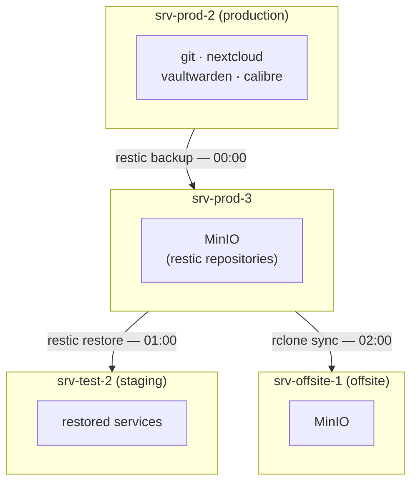

I run a small home lab.
It hosts the services my family uses daily: a [Nextcloud](https://nextcloud.com/) instance, a [Vaultwarden](https://github.com/dani-garcia/vaultwarden) password manager, a git server, and a [Calibre-Web](https://github.com/janeczku/calibre-web) library, and more.
For a long time I had no proper backup for any of this and it was giving me sleepless nights.
Since my family started relying on these services, I knew I had to do something.

## The First Attempt: app-sync

My first backup solution was a custom NixOS module I called [`app-sync`](https://github.com/britter/nix-configuration/blob/fd3aad8dcee9a44920118a2721b2b1016aa266d0/modules/app-sync/default.nix).
It used `rsync` over SSH to pull data from my production server (`srv-prod-2`) to a second server (`srv-test-2`).

This was pretty neat for two reasons.
First, I had a backup.
Second, since the data was a live replica, I could use `srv-test-2` for testing things - new service versions, configuration changes, whatever - without touching production.
So it was a backup and a staging environment at the same time.

But it had some clear limitations:

- **No history.** Every sync overwrote the previous state. If I noticed data corruption a week later, it was already gone.
- **Tightly coupled.** The restore process depended on both servers being online and able connect over SSH. If either was down, restoring was impossible.
- **No off-site copy.** Both servers lived in my home network. One power outage, one fire, one hardware failure - and everything could be gone at once.
- **Bad for security.** Because `srv-test-2` SSHed directly into production as the service users (`nextcloud`, `git`, `vaultwarden`, `calibre-web`), I had to give each of those accounts a real login shell and authorize the test server's SSH key for all of them. Service accounts should not have shell access. It works, but it expands the attack surface in a way that feels wrong.[^1]

In order to fix these limitations I redesigned my home lab back up from scratch.

[^1]:
    It's a widely disregarded fact about NixOS, that systemd services often use service user accounts with minimal permissions (e.g. no login shell) which increases NixOS's security posture.
    On a traditional distro you would have to take care of this yourself.
    With NixOS it comes for free.

## The New Architecture

The new setup is built around [restic](https://restic.net/), an excellent backup tool with built-in deduplication, encryption, and snapshot history.
Here is the high-level picture:



**srv-prod-2** runs the services and pushes restic backups to a [MinIO](https://min.io/) instance[^2] on **srv-prod-3** (a new server that I created for the purpose of hosting object storage).
MinIO is an S3-compatible object storage server, so restic talks to it exactly like it would talk to AWS S3.
There is one restic repository per service, so git, nextcloud, vaultwarden, and calibre each have their own isolated backup history.

**srv-test-2** restores from those same repositories every night at 1 AM.
This serves the same purpose as before - a staging environment - but now the restore process is also tested automatically every single night.
If the backup is broken, I will know the next morning.

**srv-offsite-1** is a small server sitting in the basement of my mother's house.
It wakes up at 2 AM, syncs the entire MinIO bucket from production using [rclone](https://rclone.org/), and then suspends itself again.
This gives me an off-site copy without having to pay for cloud storage.

This setup follows the [3-2-1 rule](https://www.backblaze.com/blog/the-3-2-1-backup-strategy/):

- **3** copies of the data (srv-prod-2, srv-prod-3, srv-offsite-1)
- **2** different storage media (srv-prod-2 and srv-prod-3 store data on NVMe, while srv-offsite-1 has a 2.5 SSD)
- **1** off-site copy

It is also a big improvement from a security point of view.
`srv-test-2` no longer needs any direct access to `srv-prod-2`.
It only has read access to the MinIO bucket, with credentials scoped per service.
Service accounts on the production server are back to having no shell access, which is how it should be.

Last but not least I can now easily move service to new hosts.
For that I create a new VM for that service, stop that service on srv-prod-2, then restore the data from the backup on the new server.

[^2]: Unfortunately in the meantime minIO has been discontinued so I'm already planning for the next backup iteration which will likely be based on [Garage](https://garagehq.deuxfleurs.fr/).

## Configuring the Backups

The NixOS [`services.restic.backups` module](https://search.nixos.org/options?channel=unstable&query=services.restic.backups) handles the production side nicely.
Here is a simplified version of the [backup configuration from `srv-prod-2`](https://github.com/britter/nix-configuration/blob/742aad431c16394051ba129e00bc01e70ebbf1f5/systems/x86_64-linux/srv-prod-2/configuration.nix):

```nix
services.restic.backups =
  let
    bucket = "s3:https://minio.srv-prod-3.ritter.family/restic-backups";
    pruneOpts = [
      "--keep-daily 14"
      "--keep-weekly 8"
      "--keep-monthly 12"
      "--keep-yearly 5"
    ];
    pg_dump = "${config.services.postgresql.package}/bin/pg_dump";
    timerConfig = {
      OnCalendar = "00:00";
      RandomizedDelaySec = "30m";
      Persistent = true;
    };
  in
  {
    git = {
      environmentFile = config.sops.templates."restic/git/secrets.env".path;
      paths = [ "/srv/git" ];
      repository = "${bucket}/git";
      initialize = true;
      inherit pruneOpts timerConfig;
    };

    nextcloud =
      let
        occ = lib.getExe config.services.nextcloud.occ;
      in
      {
        environmentFile = config.sops.templates."restic/nextcloud/secrets.env".path;
        paths = [
          "/var/lib/nextcloud/data"
          "/var/backups/nextcloud"
        ];
        repository = "${bucket}/nextcloud";
        initialize = true;
        backupPrepareCommand = ''
          ${occ} maintenance:mode --on
          sudo -u postgres ${pg_dump} --format=custom \
            --file=/var/backups/nextcloud/nextcloud.dump nextcloud
        '';
        backupCleanupCommand = ''
          rm /var/backups/nextcloud/nextcloud.dump
          ${occ} maintenance:mode --off
        '';
        inherit pruneOpts timerConfig;
      };
  };
```

The `environmentFile` contains the MinIO credentials and the restic repository password.
I manage secrets with [sops-nix](https://github.com/Mic92/sops-nix), so the actual values are encrypted in the repository and only decrypted at runtime.
The template generates a file that sets `AWS_ACCESS_KEY_ID`, `AWS_SECRET_ACCESS_KEY`, and `RESTIC_PASSWORD` as environment variables, which restic picks up automatically.

For the database-backed services I use `backupPrepareCommand` and `backupCleanupCommand`.
The Nextcloud backup puts the service into maintenance mode, dumps the PostgreSQL database with `pg_dump`, and then backs up both the data directory and the dump together.
After the backup is done, it removes the dump file and turns maintenance mode off.
Vaultwarden works similarly, except it stops the service entirely instead of using a maintenance mode.
It's important to capture the correct `pg_dump` binary that matches the postgres instance in a variable.
This is because `${pkgs.postgresql}/bin/pg_dump` can be a different version than what is used by `services.postgres` which results in backups that can't be restored.

Each backup runs at midnight with up to 30 minutes of random delay so that all four jobs do not hammer the MinIO server at exactly the same time.

## The Missing Piece: a Restic Restore Module

nixpkgs ships a `services.restic.backups` module for configuring scheduled backups.
But there is no equivalent module for scheduled restores.
For the test server that restores every night, I needed to write one myself.

I introduced [`modules/restic-restore`](https://github.com/britter/nix-configuration/blob/main/modules/restic-restore/default.nix) - a NixOS module that mirrors the backups module but for restores.
If you want to understand how the NixOS module system works, I've written about it [in a previous post](/blog/2025/01/09/nixos-modules/).
The interface looks like this:

```nix
options.services.restic.restores = lib.mkOption {
  type = lib.types.attrsOf (
    lib.types.submodule (
      { name, ... }:
      {
        options = {
          passwordFile   = lib.mkOption { ... };
          environmentFile = lib.mkOption { ... };
          repository     = lib.mkOption { ... };
          paths          = lib.mkOption { ... };
          timerConfig    = lib.mkOption {
            default = {
              OnCalendar = "daily";
              Persistent = true;
            };
            ...
          };
          user                  = lib.mkOption { default = "root"; ... };
          restorePrepareCommand = lib.mkOption { ... };
          restorePostCommand    = lib.mkOption { ... };
          createWrapper         = lib.mkOption { default = true; ... };
        };
      }
    )
  );
};
```

The implementation generates a systemd service and timer for each restore job.
The service runs `restic restore latest` with `--include` flags for each path and `--delete` to remove files that no longer exist in the snapshot:

```nix
serviceConfig = {
  Type = "oneshot";
  ExecStart = lib.optionals doRestore [
    "${resticCmd} restore latest --no-lock ${lib.concatStringsSep " " includes} --delete --target /"
  ];
  EnvironmentFile = restore.environmentFile;
};
```

The `restorePrepareCommand` and `restorePostCommand` hooks map to systemd's `preStart` and `postStart` directives, so they run before and after the actual restore.

One extra thing the module does is generate a wrapper script for each restore job like the backup module does.
This is controlled by the `createWrapper` option.
The wrapper sets the same environment variables as the systemd service, so you can run `restic-nextcloud snapshots` on the command line without having to manually specify credentials or repository URLs.
Very handy for debugging.

## Configuring the Restores

With the module in place, the restore configuration on [`srv-test-2`](https://github.com/britter/nix-configuration/blob/9d8dff6845cc68037dd7c507953eb7691fe9aead/systems/x86_64-linux/srv-test-2/configuration.nix) mirrors the backup configuration closely:

```nix
services.restic.restores =
  let
    bucket = "s3:https://minio.srv-prod-3.ritter.family/restic-backups";
    pg_restore = "${config.services.postgresql.package}/bin/pg_restore";
    timerConfig = {
      OnCalendar = "01:00";
      RandomizedDelaySec = "30m";
      Persistent = true;
    };
  in
  {
    git = {
      environmentFile = config.sops.templates."restic/git/secrets.env".path;
      paths = [ "/srv/git" ];
      repository = "${bucket}/git";
      inherit timerConfig;
    };

    nextcloud =
      let
        occ = lib.getExe config.services.nextcloud.occ;
      in
      {
        environmentFile = config.sops.templates."restic/nextcloud/secrets.env".path;
        paths = [
          "/var/lib/nextcloud/data"
          "/var/backups/nextcloud"
        ];
        repository = "${bucket}/nextcloud";
        restorePrepareCommand = "${occ} maintenance:mode --on";
        restorePostCommand = ''
          sudo -u nextcloud ${pg_restore} --clean \
            -d nextcloud /var/backups/nextcloud/nextcloud.dump
          ${occ} maintenance:mode --off
        '';
        inherit timerConfig;
      };
  };
```

The restore jobs run at 1 AM, one hour after the backups start.
The Nextcloud restore puts the service into maintenance mode, lets restic overwrite the data files and the database dump, and then uses `pg_restore --clean` to restore the database.
The `--clean` flag tells `pg_restore` to drop database objects before recreating them, which is exactly what you want for a full restore.

## The Off-Site Sync

The last piece is the off-site server in my mother's basement.
It has a MinIO instance, and a systemd timer that runs `rclone sync` every night at 2 AM to mirror the production MinIO bucket:

```nix
systemd.timers.nightly-minio-sync = {
  wantedBy = [ "timers.target" ];
  timerConfig = {
    OnCalendar = "02:00";
    Persistent = true;
    WakeSystem = true;  # wake from suspend
  };
};

systemd.services.nightly-minio-sync = {
  serviceConfig = {
    Type = "oneshot";
    # The - prefix means ExecStartPost runs even if the sync fails
    ExecStart = "-${lib.getExe pkgs.rclone} sync srv-prod-3: srv-offsite-1: \
      --config ${config.sops.templates."rclone.conf".path}";
    ExecStartPost = "${pkgs.systemd}/bin/systemctl suspend";
  };
};
```

`WakeSystem = true` makes the systemd timer wake the server from suspension.
After the sync completes, the service immediately suspends the system again.
The `-` prefix on `ExecStart` ensures that `ExecStartPost` (the suspend command) runs even if the rclone sync fails - I do not want to leave the server running all night because a sync failed.

The rclone configuration is also generated from a sops template, so the MinIO credentials are never stored in plain text in the configuration repository.

## Conclusion

I started out with no backups at all, moved to a simple rsync-based sync that gave me a replica but no history, and eventually landed on a setup that I am actually happy with.
The 3-2-1 rule is met, restores are tested automatically every night, and the whole thing is declared in Nix - which means it is reproducible, version controlled, and easy to reason about.

The one missing piece from nixpkgs was the `restic-restore` module.
Writing it was not hard, but it is the kind of thing that should exist upstream so others do not have to write it themselves.
I might submit it at some point.
For now it lives in my [nix-configuration repository](https://github.com/britter/nix-configuration).

If you want to take a look at the full configuration, you can find it here:

- [`modules/restic-restore/default.nix`](https://github.com/britter/nix-configuration/blob/742aad431c16394051ba129e00bc01e70ebbf1f5/modules/restic-restore/default.nix) - the custom restore module
- [`systems/x86_64-linux/srv-prod-2/configuration.nix`](https://github.com/britter/nix-configuration/blob/742aad431c16394051ba129e00bc01e70ebbf1f5/systems/x86_64-linux/srv-prod-2/configuration.nix) - the backup configuration
- [`systems/x86_64-linux/srv-test-2/configuration.nix`](https://github.com/britter/nix-configuration/blob/9d8dff6845cc68037dd7c507953eb7691fe9aead/systems/x86_64-linux/srv-test-2/configuration.nix) - the restore configuration
- [`systems/x86_64-linux/srv-offsite-1/configuration.nix`](https://github.com/britter/nix-configuration/blob/742aad431c16394051ba129e00bc01e70ebbf1f5/systems/x86_64-linux/srv-prod-2/configuration.nix) - the off-site sync configuration

If you need help with NixOS or want to optimize your setup, I offer [NixOS consulting services](/services/nixos).
Feel free to get in touch!
